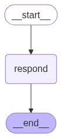

# Description
It gives you basic chat agent behaviour. It has in-memory history for chat context user wise.

# project setup
1. uv init agent-example-001
2. uv venv
3. source .venv/bin/activate
4. uv sync

# run locally
1. start agent server: uvicorn main:app --host 0.0.0.0 --port 8000
2. send user questions: curl -X POST http://localhost:8000/chat \
  -H "Content-Type: application/json" \
  -d '{"user_id": "abc123", "message": "What is the capital of Japan?"}'
3. shutdown agent server: press CTRL+C or find and kill the port like lsof -i tcp:8000 and kill -9 PID

