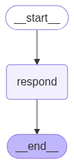

# Description
It gives you basic chat agent behaviour with RAG. It has in-memory history for chat context user wise and chromadb as vector database. 

# Downside
It has hallucination issue if nothing is retrieved from RAG. This could be overcome by external call using Hybrid RAG (Local + Web Retrieval). 

# chat agent flow graph

# project setup
1. uv init agent-example-002
2. uv venv
3. source .venv/bin/activate
4. uv sync

# environment configurations, you can put in bash_profile or .env
1. export OPENAI_API_KEY=xxxxxx
2. export LANGSMITH_TRACING=true
3. export LANGSMITH_API_KEY=xxxxxx
4. export LANGSMITH_PROJECT="chatbot-agent-test"

# RAG information
1. add context data in file rag_docs/country_information.txt

# run agent server locally
1. start agent server: uvicorn src.main:app --host 0.0.0.0 --port 8000
2. send user questions: 
  curl -X POST http://localhost:8000/chat \
  -H "Content-Type: application/json" \
  -d '{"user_id": "abc123", "message": "What is the capital of india?"}'

  curl -X POST http://localhost:8000/chat   -H "Content-Type: application/json"   -d '{"user_id": "abc123", "message": "What is the per capita income of that?"}'

  curl -X POST http://localhost:8000/chat   -H "Content-Type: application/json"   -d '{"user_id": "abc123", "message": "What is the per capita income and male/female ratio of that?"}'
  
3. shutdown agent server: press CTRL+C or find and kill the port like lsof -i tcp:8000 and kill -9 PID

# test case execution
1. for integration tests: pytest tests/integration
2. for unit tests: pytest tests/unit
3. for code coverage: pytest --cov=src
4. for code coverage report: pytest --cov=src --cov-report=html
